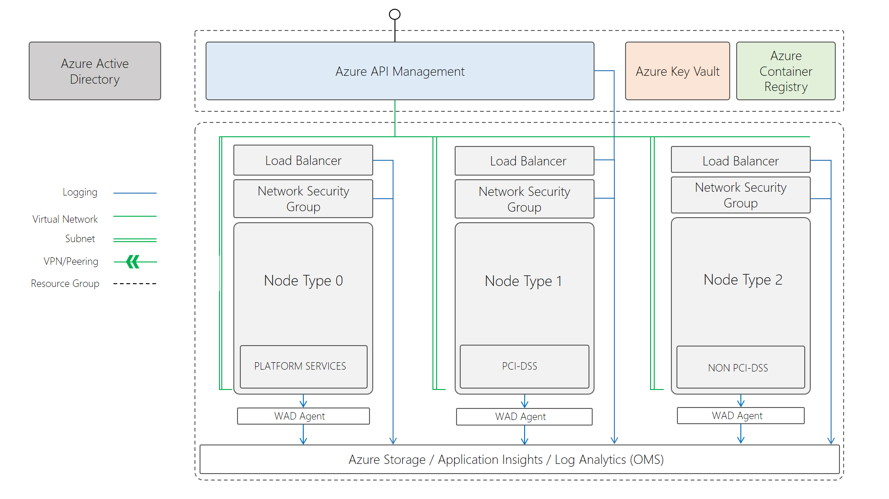

## Service Fabric Deployment
This repo contains some templates and script to deploy a specific Service Fabric topology to Azure.

The cluster that will be deployed will have the following properties:
* 3 distinct cluster node types with dedicated
    * Azure Load Balancers
    * Subnets
    * Network Security Groups
    * Placement properties for isolated application deployments (PCI-DSS and non PCI-DSS)
* Active directory authentication
* Azure Key Vault certificate(s)
* API Management gateway
* DNS Service
* Reverse Proxy
* Windows Container Support
* Managed disks
* Operational Management Suite monitoring
* Appliation Insights monitoring
* Private Azure Container Registry

This setup is split across 2 resources groups.
* Peripheral resources which can potentially out live a cluster deployment.
* Core cluster resources that require strong coupling to the cluster's life cycle.



## Instructions
To deploy these components, you must follow **the following instructions, in order**.

1. Copy the example environment file to you local environment file.
```
cp env.example.ps1 env.ps1
```
2. Edit env.ps1 and provide a value for each key
3. Source the environment variable file
```
. env.ps1
```
4. Deploy an Azure Key Vault with self-signed certificate
```
.\scripts\key-vault\key-vault.ps1 `
-AzureSubscriptionId $subId `
-AzureResourceGroupName $extRgName `
-AzureResourceGroupLocation $extRgLoc `
-KeyVaultName $kvName `
-CertDnsName $clusterName `
-CertName $certName `
-Password $certPassword
```
5. Create an Application Registration in your Azure Active Directory tenant.
```
.\scripts\active-directory\SetupApplications.ps1 `
-TenantId $aadTenantId `
-ClusterName "$clusterName.$clusterRgLoc.cloudapp.azure.com" `
-WebApplicationReplyUrl "https://$clusterName.$clusterRgLoc.cloudapp.azure.com:19080/Explorer/index.html"
```
Record the output values for the following properties in a file:

`tenantId` \
`clusterApplication` \
`clientApplication`

6. Add yourself and others as users and groups within your Azure Active Directory Application Registration. This can been done through the portal https://portal.azure.com.

7. Edit the parameters file: `templates\service-fabric\azuredeploy.parameters.json`. Modify the parameters to match your desired cluster configuration. Key Vault details can be found in the text file `key-vault.txt` and Active Directory details were output in step 5.

8. Deploy the Azure Service Fabric cluster.
```
.\scripts\service-fabric\service-fabric.ps1 `
-AzureSubscriptionId $subId `
-AzureResourceGroupName $clusterRgName `
-AzureResourceGroupLocation $clusterRgLoc
```
Beware, this may take a little while.

9. Deploy an API Management instance to facade your cluster's APIs
```
.\scripts\api-management\api-management.ps1 `
 -AzureSubscriptionId $subId `
 -DeployToResourceGroupName $extRgName `
 -DeployToResourceGroupLocation $extRgLoc `
 -ApimName $apimName `
 -VNetResourceGroupName $clusterRgName `
 -VNetResourceGroupLocation $clusterRgLoc `
 -Organization $apimOrg `
 -AdminEmail $apimAdminEmail
```
Note, this should attach to your cluster's virtual network. If it doesn't, manual connect it to the APIM subnet on the 'VNet' virtual network.

10. If you plan to deploy Windows Container service to Service Fabric you'll probably want a private Azure Container Registry.
Edit the template parameters file: `templates\continer-registry\azuredeploy.parameters.json`.

11. Deploy the Azure Container Registry.

```
.\scripts\container-registry\container-registry.ps1 `
-AzureSubscriptionId $subId `
-AzureResourceGroupName $extRgName
```

12. Once all the deployments have completed successfully, you can grab your Service Fabric endpoint from the portal or the `service-fabric.txt` file.